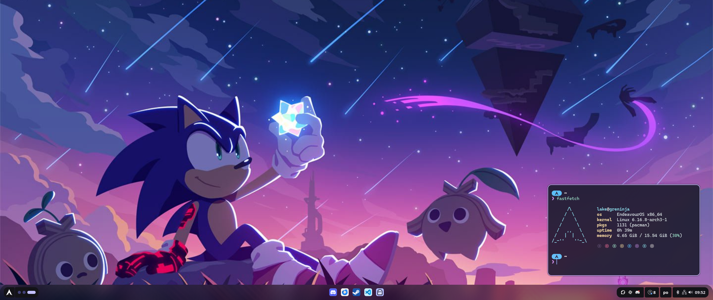
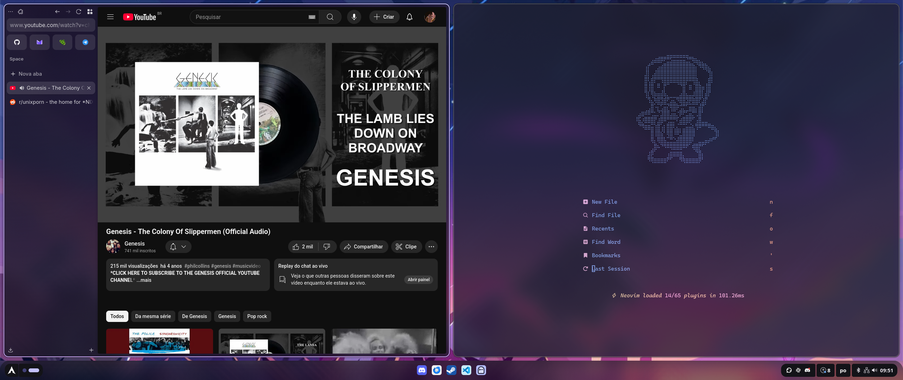
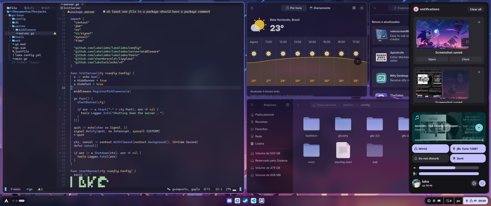

# my dotfiles
My current dots for Hyprland on Arch/EndeavourOS. I know it is not the best, and it's still a work in progress, but hey I'm proud of this.

There isn't a script to install this, but I recommend using [stow](https://www.gnu.org/software/stow/) to create symlinks between the folders and your home directory. 

## Tools
- WM: [hyprland](./.config/hypr)
  - [hyprlock](./.config/hypr/hyprlock.conf)
  - hypridle
- Launcher and taskbar: [ignis](./.config/ignis/)
  - python-pillow
  - python-materialyoucolor-git
  - python-j2cli (Jinja2)
- Shell: [zsh](./zshrc)
  - fzf
  - zoxide
  - zsh-syntaxhighlighting
  - zsh-autosuggestions
  - bat
  - jq
  - fd
  - stow
- Terminal: [ghostty](./.config/ghostty/config)
- Prompt: [starship](./.config/starship.toml)
- Editor: [nvim (astronvim)](./.config/nvim/)
- Browser: zen browser (theme not included)
- Icons: [Colloid by vinceliuice](https://github.com/vinceliuice/Colloid-icon-theme/tree/main)

## Things I want to do
- Change launcher from ignis to something else
  - or maybe try quickshell and see how it works
- Change icon theme (some icons are missing, or do not fit very well)
- Continue tweaking GTK theme

## Credits
- [linkfrg](https://github.com/linkfrg/dotfiles/) for inspiration
- [imbypass](https://github.com/imbypass/dots) for inspiration
- GTK theme based on [Omarchy](https://github.com/basecamp/omarchy)
